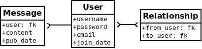

# peewee学习笔记：应用实例

[TOC]

------

这是peewee作者准备的一个网页案例，用flask快速搭建的一个网站。那后面我如果有什么应用也可以做成这样来直接使用。这个案例在`peewee/example`里。Let‘s go.

## 先装flask

```
pip install flask
```

## 启动案例


flask安装后, `cd` 进入tweet目录， 运行 `run_example.py` 脚本。

 一般都会在这个目录之下：


一路`cd`进入`twitter`目录：


```bash
python run_example.py
```

在浏览器输入这个地址：http://localhost:5000/ 直接访问，就可以看到案例网页了。

## 代码分解

详细的代码在  `example/twitter/app.py`这个文件里。里面构建了一个falsk的基本框架和peewee构建的Models。

### Models

#### 	User：

​	用户有用户名、密码、邮箱地址和注册时间的属性。

#### 	Relationships:

​	不同用户直接有2种关系，A关注了B，A被C关注。这里就出现了关注与被关注的2种关系。2个外键属性：`from_user`和`to_user`。

#### 	tweet：

​	用户发的推特，一段文字。3个属性：`内容`、`发布时间`和外键属性`发布人`

用UML图表示就是：



用`SqliteDatabase()`创建上面的数据结构：

```python
# create a peewee database instance -- our models will use this database to
# presist information
'''
创建一个peewee数据库实例 --> app.py脚本里面，在最前面定义了 DATABASE = 'tweepee.db'
数据会保存在'tweepee.db'文件中
'''
database = SqliteDatabase(DATABASE)

# model definitions -- the standard "pattern" is to define a base model class
# that specifies which database to use.  then, any subclasses will automatically
# use the correct storage.
'''
model类定义 --> 标准写法，避免重复和出错
'''
class BaseModel(Model):
    class Meta:
        database = database

# the user model specifies its fields (or columns) declaratively, like django
'''
定义User类，是BaseModel的子类，一张表
'''     
class User(BaseModel):
    username = CharField(unique=True)  #设置属性，表里面的fields(or columns)
    password = CharField()
    email = CharField()
    join_date = DateTimeField()

# this model contains two foreign keys to user -- it essentially allows us to
# model a "many-to-many" relationship between users.  by querying and joining
# on different columns we can expose who a user is "related to" and who is
# "related to" a given user
'''
这个 model 包含两个关联到 user 的外键, 这种结构可以实现user之间的‘多对多’关系。
通过关联查询不同的列，可以实现查找‘关注’与‘被关注’。
'''
class Relationship(BaseModel):
    from_user = ForeignKeyField(User, backref='relationships')
    to_user = ForeignKeyField(User, backref='related_to')

    class Meta:
        # `indexes` is a tuple of 2-tuples, where the 2-tuples are
        # a tuple of column names to index and a boolean indicating
        # whether the index is unique or not.
        '''
        ' indexes '是一个由2元组组成的元组，其中2元组是一个由索引的列名和一个
        指示索引是否唯一的布尔值组成的元组。
        '''
        indexes = (
            # Specify a unique multi-column index on from/to-user.
            (('from_user', 'to_user'), True),
        )

# a dead simple one-to-many relationship: one user has 0..n messages, exposed by
# the foreign key.  because we didn't specify, a users messages will be accessible
# as a special attribute, User.messages
'''
一个非常简单的一对多关系:一个用户有0..n条消息，通过外键公开。
因为没有指定，所以用户消息可以作为一个特殊属性访问--User.messages
'''
class Message(BaseModel):
    user = ForeignKeyField(User, backref='messages')
    content = TextField()
    pub_date = DateTimeField()
```

Peewee支持许多不同的字段类型，它们映射到数据库引擎通常支持的不同列类型。python类型与数据库中使用的类型之间的转换是透明处理的，允许您在应用程序中使用以下内容:

- Strings (unicode or otherwise)
- Integers, floats, and `Decimal` numbers.
- Boolean values
- Dates, times and datetimes
- `None` (NULL)
- Binary data

### 创建表格

为了开始使用Models，有必要创建表。这是一次性操作，可以使用交互式解释器快速完成。我们可以创建一个小的`helper()`函数来完成这个任务:

```python
def create_tables():
    with database:
        database.create_tables([User, Relationship, Message])
```

在命令行工具中输入：

```bash
>>> from app import *
>>> create_tables()
```

每个模型都有一个`create_table()`类方法，它在数据库中运行一个`SQL CREATE TABLE`语句。此方法将创建包函所有列、外键约束、索引和序列的表。通常在添加新模型时，这个动作只需要做一次。

Peewee提供了一个helper方法`Database.create_tables()`，它将解析模型间的依赖关系，并在每个模型上调用`create_table()`，确保按顺序创建表。所以，多表同时创建时，用`create_tables()`更好。

> **在创建表之后添加字段需要删除表或者重新创建，或者使用ALTER TABLE 查询手动添加列。**
>
> **另外，还可以使用schema migrations扩展使用Python更改数据库模式。**

### 建立数据库连接

您可能已经注意到，在上面的模型代码中，在基础模型上定义了一个名为Meta的类，用于设置数据库属性。Peewee允许每个模型指定它使用的数据库。有许多Meta选项，你可以指定哪个控制你的模型的行为。

```python
DATABASE = 'tweepee.db'

# Create a database instance that will manage the connection and
# execute queries
database = SqliteDatabase(DATABASE)

# Create a base-class all our models will inherit, which defines
# the database we'll be using.
class BaseModel(Model):
    class Meta:
        database = database
```

在开发web应用程序时，通常在请求启动时打开连接，在响应返回时关闭连接。你应该总是显式地管理你的连接。例如，如果您正在使用连接池，那么只有在调用connect()和close()时，连接才会被正确地回收。

我们将告诉flask，在请求/响应周期中，我们需要创建一个到数据库的连接。flask提供了一些方便的装饰器来实现这一点:

```python
@app.before_request
def before_request():
    database.connect()

@app.after_request
def after_request(response):
    database.close()
    return response
```

Peewee使用线程本地存储来管理连接状态，因此该模式可以用于多线程的WSGI服务器。

### 进行查询

在User模型中，有一些实例方法封装了一些特定于用户的功能:

- `following()`: 这个用户在关注谁?
- `follower()`: 谁在关注这个用户?

两个方法在实现方式上是相似的，但是在SQL JOIN和WHERE子句上有一个重要的区别:

```python
def following(self):
    # query other users through the "relationship" table
    return (User
            .select()
            .join(Relationship, on=Relationship.to_user)
            .where(Relationship.from_user == self)
            .order_by(User.username))

def followers(self):
    return (User
            .select()
            .join(Relationship, on=Relationship.from_user)
            .where(Relationship.to_user == self)
            .order_by(User.username))
```

### 创建新对象

当一个新用户想要加入我们这个网站时，我们需要确认用户名可用，如果可用，那就会创建一个新的用户记录。看看`join()`函数，用的是`Model.create()`来创建用户。之前定义了用户名字段的唯一约束，因此如果已经使用的用户名，数据库将引发一个`IntegrityError`。

```python
try:
    with database.atomic():
        # Attempt to create the user. If the username is taken, due to the
        # unique constraint, the database will raise an IntegrityError.
        user = User.create(
            username=request.form['username'],
            password=md5(request.form['password']).hexdigest(),
            email=request.form['email'],
            join_date=datetime.datetime.now())

    # mark the user as being 'authenticated' by setting the session vars
    auth_user(user)
    return redirect(url_for('homepage'))

except IntegrityError:
    flash('That username is already taken')
```

当用户希望追随某人时，我们将使用类似的方法。为了指示以下关系，我们在Relationship表中创建一行，从一个用户指向另一个用户。由于from_user和to_user上的索引是唯一的，可以确保不会出现重复的行:

```python
user = get_object_or_404(User, username=username)
try:
    with database.atomic():
        Relationship.create(
            from_user=get_current_user(),
            to_user=user)
except IntegrityError:
    pass
```

### 执行子查询

如果我已经登录并访问了twitter主页，我可以看到来自我关注的用户的tweet。为了实现这一点，我们可以使用子查询来实现。

默认情况下，子查询`User .following()` 会选择用户模型上的所有列。因为我们将它用作子查询，peewee将只选择主键。

```python
# python code
user = get_current_user()
messages = (Message
            .select()
            .where(Message.user.in_(user.following()))
            .order_by(Message.pub_date.desc()))
```

这段代码对应于以下SQL查询:

```sql
SELECT t1."id", t1."user_id", t1."content", t1."pub_date"
FROM "message" AS t1
WHERE t1."user_id" IN (
    SELECT t2."id"
    FROM "user" AS t2
    INNER JOIN "relationship" AS t3
        ON t2."id" = t3."to_user_id"
    WHERE t3."from_user_id" = ?
)
```

反正我是没看懂，干脆不看了。

### 其他话题

在案例中还有其他一些值得简单提及的事情。

- 对结果列表分页的支持是通过一个简单的函数object_list实现的（这是Django中的必然结果）。函数用来返回所有对象列表视图。

  ```python
  def object_list(template_name, qr, var_name='object_list', **kwargs):
      kwargs.update(
          page=int(request.args.get('page', 1)),
          pages=qr.count() / 20 + 1)
      kwargs[var_name] = qr.paginate(kwargs['page'])
      return render_template(template_name, **kwargs)
  ```

- 用login_required装饰器的简单身份验证系统。第一个函数只是在用户成功登录时将用户数据添加到当前会话中。装饰器login_required可用于包装视图函数，检查会话是否经过身份验证，如果没有重定向到登录页面。

  ```python
  def auth_user(user):
      session['logged_in'] = True
      session['user'] = user
      session['username'] = user.username
      flash('You are logged in as %s' % (user.username))
  
  def login_required(f):
      @wraps(f)
      def inner(*args, **kwargs):
          if not session.get('logged_in'):
              return redirect(url_for('login'))
          return f(*args, **kwargs)
      return inner
  ```

- 当在数据库中找不到对象时，返回404响应，而不是抛出异常。

  ```python
  def get_object_or_404(model, *expressions):
      try:
          return model.get(*expressions)
      except model.DoesNotExist:
          abort(404)
  ```

为了避免频繁的复制粘贴 [`object_list()`](http://docs.peewee-orm.com/en/latest/peewee/playhouse.html#object_list) 或 [`get_object_or_404()`](http://docs.peewee-orm.com/en/latest/peewee/playhouse.html#get_object_or_404)的代码，可以用peewee自己带的工具：

```python
from playhouse.flask_utils import get_object_or_404, object_list
```

### 更多案例

peewee examples目录中还有更多案例, 包括:

- [Example blog app](https://github.com/coleifer/peewee/tree/master/examples/blog):  使用Flask + peewee. 地址： [accompanying blog post](http://charlesleifer.com/blog/how-to-make-a-flask-blog-in-one-hour-or-less/).
- [An encrypted command-line diary](https://github.com/coleifer/peewee/blob/master/examples/diary.py). 地址：[companion blog post](http://charlesleifer.com/blog/dear-diary-an-encrypted-command-line-diary-with-python/) 
- [Analytics web-service](https://github.com/coleifer/peewee/tree/master/examples/analytics) (Google Analytics的简化版). 地址： [companion blog post](http://charlesleifer.com/blog/saturday-morning-hacks-building-an-analytics-app-with-flask/).

> **牛逼的东西：看看 [flask-peewee](https://github.com/coleifer/flask-peewee)—这是一个flask插件，它为你的peewee模型提供了一个类似django的管理界面、RESTful API、认证等。**

